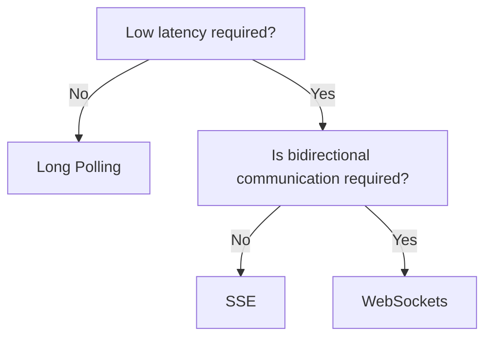

## 📡 Long Polling
1. Client initiates request  
2. Server either provides update within timeout  
3. Or else Server times out and respond  
4. Client sends another request
 
## 📢 SSE
1. Persistent connection maintained  
2. Server can send data to client one way  
3. Reconnect handling If disconnected can lead to thundering herd if all clients tries to reconnect at same time. Use jitter, exponential backoff  
4. Horizontal scaling. Need LB and sticky session since  

## 🔌 WebSockets
“WebSockets shift challenge from stateless request scaling to stateful connection scaling.”
1. Persistent connections  
2. Bidirectional comms between server and client  
3. Horizontal scaling. Need LB and sticky session since Requests can hit any server, but socket lives on one server.  
4. Message routing - Redis Pub/Sub, Kafka  
5. Failure handling - reconnect strategy  
